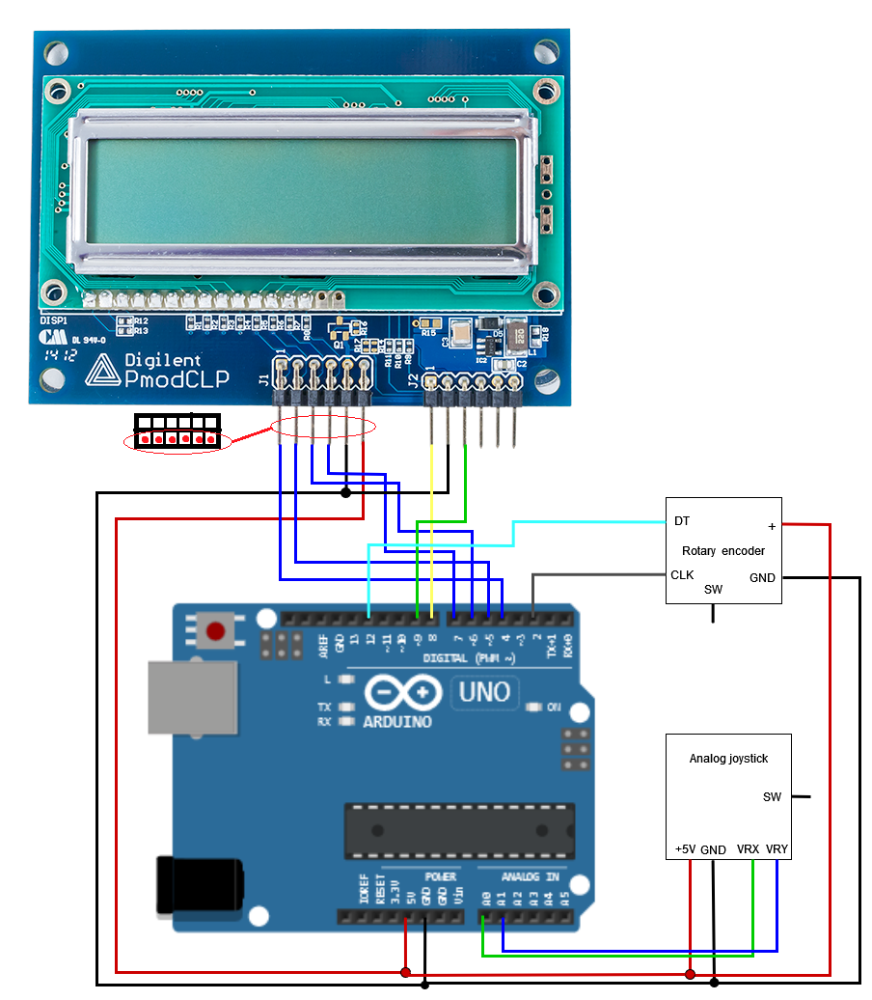

# Digital Electronics 2 - Project 1

## Geometric Calculator

This project was created in the spirit of showing an example how could the analog joy-stick, rotary encoder and Digilent PmodCLP LCD module
be combined into single working system on the platform of Arduino UNO. The project is a calculator which can compute surface and perimeter
of rectangle or circle. Moving the joystick up or down changes the result type (rectangle or circle) and moving it left or right switches
between the input variables. Encoder is used to change value of the selected input variable.

### Team members

* Adam Ondrejka
* Dominik Vaško

## Hardware description

To run the simulation:
* go to the [project simulation webpage](https://wokwi.com/projects/350052781060522578)
* click into the "source_code.ino" tab in the top left part of the screen
* click anywhere into the empty code
* press F1 and type "HEX"
* select "Load HEX file and Start Simulation"

Insert descriptive text and schematic(s) of your implementation.

## Software description

Put flowchats of your algorithm(s). Write descriptive text of your libraries and source files. Put direct links to these files in `src` or `lib` folders.

## Video

[Short video showing the working project](https://youtu.be/gwnjN7g5l00)

## References

1. Write your text here.
2. [Digilent PmodCLP LCD module picture](https://digilent.com/reference/_media/reference/pmod/pmodclp/pmodclp-1.png)
3. [Digilent PmodCLP LCD module pinout](https://digilent.com/reference/pmod/pmodclp/start)
